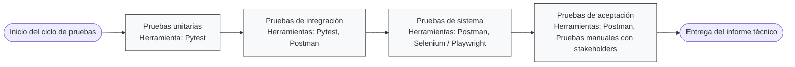

# AgroSense Tech - Minimal FastAPI prototype

Project skeleton implementing two endpoints for sensor ingestion and a simple dashboard.

How to run

1. Create a virtual environment (optional) and install dependencies:

```powershell
python -m pip install -r requirements.txt
```

2. Run the app:

```powershell
python main.py
# or
uvicorn main:app --reload
```

3. Run tests:

```powershell
python -m pytest -q
```

## Diagrama del plan de pruebas

Pega el siguiente bloque en un visor que soporte Mermaid (por ejemplo GitHub README, VS Code con extensión Mermaid, o https://mermaid.live) para visualizar el flujo del plan de pruebas.



Breve explicación: Unidad → Integración → Sistema → Aceptación, con herramientas sugeridas listadas en cada bloque.
